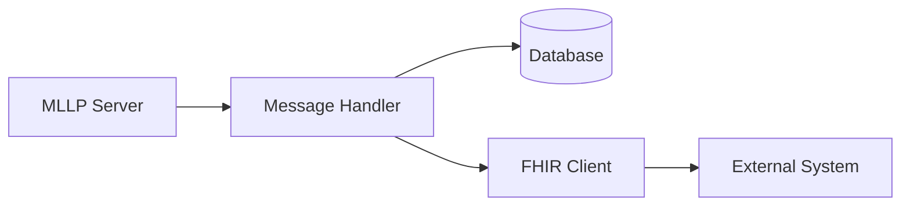
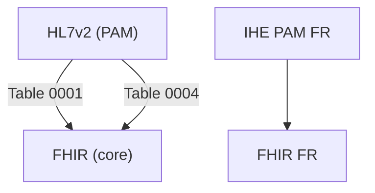

# MedData Bridge

Application FastAPI pour l'interopérabilité HL7v2 (MLLP) et FHIR dans le contexte français.

## Démarrage rapide

```bash
# 1. Créer et activer l'environnement virtuel
python -m venv .venv
source .venv/bin/activate  # Linux/Mac
# ou .venv\Scripts\activate  # Windows

# 2. Installer les dépendances
pip install -r requirements.txt

# 3. Initialiser la base de données (complète : structure + vocab + namespaces + population)
python init_db.py

# 4. Démarrer le serveur
uvicorn app.app:app --reload

# 5. Accéder à l'interface admin
# http://localhost:8000/admin/ght/1/ej/1
```

**Pour plus de détails sur l'initialisation, voir [INIT_GUIDE.md](INIT_GUIDE.md)**

## Installation détaillée

```bash
# Créer un environnement virtuel
python -m venv .venv

# Activer l'environnement
source .venv/bin/activate  # Linux/Mac
.venv\Scripts\activate     # Windows

# Installer les dépendances
pip install -r requirements.txt
```


## Configuration

L'application utilise des variables d'environnement pour sa configuration :

| Variable | Description | Valeurs | Par défaut |
|----------|-------------|---------|------------|
| TESTING | Mode test (pas d'init DB ni serveurs MLLP) | 0, 1, true, True | 0 |
| INIT_VOCAB | Initialiser les vocabulaires au démarrage | 0, 1, true, True | 0 |
| MLLP_TRACE | Logs MLLP détaillés | 0, 1, true, True | 0 |
| PAM_AUTO_CREATE_UF | Auto-création UF placeholder si absente | 0, 1, true, True | 0 |
| MFN_AUTO_VIRTUAL_POLE | Auto-création de pôle virtuel si un service est importé sans pôle parent | 0, 1, true, True | 1 |
| STRICT_PAM_FR | Mode strict IHE PAM France global | 0, 1, true, True | 0 |
| SSL_CERT_FILE | Certificat CA pour FHIR | chemin fichier | None |
| REQUESTS_CA_BUNDLE | Bundle CA pour FHIR | chemin fichier | None |

## Démarrage

### Développement

```bash
# Démarrer avec rechargement auto
PYTHONPATH=. .venv/bin/python -m uvicorn app.app:app --reload

# Démarrer avec initialisation des vocabulaires
INIT_VOCAB=1 PYTHONPATH=. .venv/bin/python -m uvicorn app.app:app --reload

# Démarrer avec logs MLLP détaillés
MLLP_TRACE=1 PYTHONPATH=. .venv/bin/python -m uvicorn app.app:app --reload

# Tout combiner
INIT_VOCAB=1 MLLP_TRACE=1 PYTHONPATH=. .venv/bin/python -m uvicorn app.app:app --reload --debug
```

### Production

En production, utilisez gunicorn avec des workers uvicorn :

```bash
PYTHONPATH=. .venv/bin/python -m gunicorn app.app:app -k uvicorn.workers.UvicornWorker -w 4
```

### Initialisation complète (base + seed)

Pour accélérer un onboarding local, un script d'initialisation idempotent est disponible :

```bash
# (Re)crée la base et insère un jeu minimal (Patient+Dossier+Venue+Mouvement)
PYTHONPATH=. .venv/bin/python scripts_manual/init_full.py

# Réinitialiser complètement (supprime medbridge.db avant)
PYTHONPATH=. .venv/bin/python scripts_manual/init_full.py --force-reset
```

Ensuite démarrez l'application :

```bash
PYTHONPATH=. .venv/bin/python -m uvicorn app.app:app --reload
```

Flags supplémentaires disponibles :

```text
--with-vocab          Initialise les vocabulaires (équivalent tools/init_vocabularies.py)
--force-reset         Supprime medbridge.db avant recréation
--extended-structure  Crée une structure étendue (GHT + 2 EJ + hiérarchie complète: site, pôle, services, UF, UH, chambres, lits + namespaces identifiants IPP/NDA/VN/MVT)
--rich-seed           Insère un jeu multi-patients (~100 patients, ~150 dossiers, ~300 venues, ~1000 mouvements) réutilisant les UF réelles si présentes
--demo-scenarios      Ajoute un contexte GHT DEMO avec 2 EJ minimal + scénarios mouvements (transferts, annulations, multi-transferts) liés aux UF réelles
(*auto-vocab*)        Les vocabulaires sont chargés automatiquement si --extended-structure est utilisé sans --with-vocab
```

Exemples :

```bash
# Init + vocabulaires
PYTHONPATH=. .venv/bin/python scripts_manual/init_full.py --with-vocab

# Structure étendue + seed riche + scénarios démo + vocabulaires
PYTHONPATH=. .venv/bin/python scripts_manual/init_full.py --force-reset --extended-structure --rich-seed --demo-scenarios --with-vocab
```

Le seed est ignoré si des patients existent déjà (idempotent). Pour que le seed riche s'appuie sur la structure,
créez d'abord la structure étendue (flag --extended-structure) avant d'exécuter --rich-seed.

### Identifiants IHE PAM France

Selon le profil IHE PAM France, les identifiants métier sont positionnés dans des segments spécifiques :

| Segment | Champ | Entité | Description | Exemple |
|---------|-------|--------|-------------|---------|
| **PID-3** | Patient Identifier List | Patient | Identifiants du patient (peut contenir plusieurs identifiants) | `12345^^^FACILITY^PI` |
| **PID-18** | Patient Account Number | Dossier | Identifiant du dossier administratif | `D001^^^FACILITY^AN` |
| **PV1-19** | Visit Number | Venue | Identifiant de la venue/séjour | `V2023001^^^FACILITY^VN` |
| **ZBE-1** | Movement Identifier | Mouvement | Identifiant du mouvement (extension IHE PAM FR) | `M001^^^FACILITY^PI` |

**Format CX (Composite ID with Check Digit)** :

```text
<ID>^<Check Digit>^<Check Digit Scheme>^<Assigning Authority>^<Identifier Type Code>
```

**Bonnes pratiques** :

- Utiliser des identifiants stables et uniques par établissement
- PID-3 peut contenir plusieurs identifiants (INS, IPP, etc.)
- ZBE-1 permet de tracer précisément chaque mouvement pour les annulations (A11, A12, A13, etc.)

### Auto-création des Unités Fonctionnelles (UF)

Lorsqu'un message PAM référence une UF (Unité Fonctionnelle) via ZBE-7 qui n'existe pas dans la structure, deux comportements sont possibles :

1. **Mode strict** (par défaut, `PAM_AUTO_CREATE_UF=0`) : le message est rejeté avec une erreur explicite indiquant l'UF manquante. C'est le comportement recommandé en production pour garantir la cohérence des données.

2. **Mode permissif** (`PAM_AUTO_CREATE_UF=1`) : l'UF est créée automatiquement comme placeholder virtuel sous un service "AUTO_SERVICE". Utile pour :
   - Tests et développement (évite de créer manuellement toutes les UF)
   - Intégration initiale (permet d'ingérer les données avant import MFN^M05 de la structure)
   - Migration legacy (accepte les codes UF temporaires)

Pour activer l'auto-création :

```bash
export PAM_AUTO_CREATE_UF=1
# Ou au démarrage
PAM_AUTO_CREATE_UF=1 PYTHONPATH=. .venv/bin/python -m uvicorn app.app:app --reload
```

Les UF auto-créées sont marquées `is_virtual=True` et peuvent être complétées ultérieurement via l'UI d'admin ou un import MFN^M05.

### Auto-création des Pôles / Services virtuels (import MFN^M05)

Lors de l'import d'un message MFN^M05 réel, certaines hiérarchies peuvent être incomplètes (ex: un service fait référence directement à une Entité Géographique sans qu'un pôle n'ait été défini entre les deux, ou une UF référence un service inexistant). Pour garantir l'ingestibilité et conserver la traçabilité des identifiants, le moteur applique les règles suivantes :

1. Si un SERVICE est rencontré sans pôle parent explicite, un pôle virtuel `VIRTUAL-POLE-<code_service>` est créé sous l'Entité Géographique correspondante (`is_virtual=True`).
2. Si une UF référence un SERVICE absent, un service virtuel `VIRTUAL-SERVICE-<code_uf>` est créé (lui-même sous un pôle virtuel si nécessaire) puis l'UF est rattachée.
3. Les entités virtuelles sont marquées `is_virtual=True` pour permettre un remplacement ultérieur lors d'un import complet de structure.
4. L'import est idempotent : si l'entité existe déjà (même code), ses métadonnées sont mises à jour sans générer d'erreur de contrainte UNIQUE.

Avantages :

- Permet de charger des fichiers de structure partiels en phase de migration ou de recette.
- Évite les erreurs de clé étrangère (`pole_id` NULL) sur les services isolés.
- Facilite le chaînage immédiat avec l'import des messages PAM (mouvements) sans bloquer sur la complétude de la hiérarchie.

Bonnes pratiques :

- Planifier un second import MFN^M05 "complet" une fois les codes établis pour remplacer les entités virtuelles.
- Surveiller via l'UI admin la présence de `is_virtual=True` et régulariser avant la mise en production.
- Activer `MFN_AUTO_VIRTUAL_POLE=0` en production si vous souhaitez rejeter les services orphelins et imposer une hiérarchie stricte.

Pour désactiver la création automatique de pôles virtuels :

```bash
export MFN_AUTO_VIRTUAL_POLE=0
```

Pour réactiver :

```bash
export MFN_AUTO_VIRTUAL_POLE=1
```

### Mode strict IHE PAM France (global & par Entité Juridique)

Le mode strict supprime totalement l'événement A08 (mise à jour patient) pour se conformer au périmètre IHE PAM France (pas de message de mise à jour identité hors flux admissions/mouvements/annulations).

Deux niveaux de contrôle complémentaires :

1. Flag modèle `EntiteJuridique.strict_pam_fr` (par défaut `True`) : chaque Entité Juridique peut activer/désactiver individuellement le mode strict. Si `True`, A08 est bloqué en émission et en réception pour les endpoints liés à cette EJ.
2. Variable d'environnement `STRICT_PAM_FR=1` : active le mode strict global pour tous les endpoints (utilisée comme fallback si un endpoint n'a pas d'EJ ou pour homogénéiser en local).


Effets quand strict actif (per-EJ ou global) :

1. Générateur (`hl7_generator`) : `generate_update_message` lève `NotImplementedError`.
2. Génération générique (`generate_adt_message`) : A08 retiré de la liste des triggers de mouvement et rejeté si demandé.
3. Inbound (`transport_inbound`) : message ADT^A08 rejeté avec ACK AE.
4. Scénarios de démo (`--demo-scenarios`) : aucun A08 créé.
5. Comportement : par défaut `EntiteJuridique.strict_pam_fr = True` (toutes les EJ héritent du mode strict initialement).


Pour activer strict global :

```bash
export STRICT_PAM_FR=1
```

Pour désactiver strict global (les EJ individuelles continuent d'appliquer leur propre flag) :

```bash
unset STRICT_PAM_FR
```

Pour assouplir une seule EJ (autoriser A08 uniquement pour celle-ci) dans un script Python :

```python
from sqlmodel import Session, select
from app.db import engine
from app.models_structure_fhir import EntiteJuridique

with Session(engine) as session:
   ej = session.exec(select(EntiteJuridique).where(EntiteJuridique.finess_ej=="123456789")).first()
   ej.strict_pam_fr = False
   session.add(ej)
   session.commit()
```

Bonnes pratiques :

1. Laisser strict activé par défaut pour vérifier les workflows de base.
2. Désactiver ponctuellement côté EJ pour tester les cas legacy A08.
3. Ne pas mélanger A08 avec Z99 pour les corrections partielles en mode strict.

### Milestone v0.2.0 (HL7v2 + FHIR Roundtrip)

Cette version marque un cap fonctionnel : le moteur est capable de simuler un logiciel d'interopérabilité hospitalier avec ingestion et émission HL7v2 (ADT PAM France, MFN^M05 structure) et génération/mapping FHIR.

Principales capacités prouvées dans la branche :

1. Import réel MFN^M05 avec hiérarchie partielle et auto-création contrôlée de pôles/services virtuels (`MFN_AUTO_VIRTUAL_POLE`).
2. Ingestion lotie de ~1k messages PAM avec validation de transitions IHE (table de passage explicitée dans `app/state_transitions.py`).
3. Génération de messages ADT (A01/A03/A06/A07/A11/A13/A04/A05, annulations incluses) avec adaptation stricte (A08 désactivé) selon flags EJ / global.
4. Roundtrip identifiants (PID-3 IPP, PID-18 AN, PV1-19 VN, ZBE-1 MVT) consolidé dans test d'intégration `tests/test_production_integration.py`.
5. Validation centralisée des transitions + rejet explicite avec ACK `MSA|AE` détaillé.
6. Fallback d'encodage latin-1 pour ingestion legacy (évite les erreurs Unicode sur des dumps historiques).
7. Champs `uf_responsabilite` rendus optionnels sur `Dossier` et `Venue` pour compatibilité scénarios partiels/pré-admission; résolution automatique ou marquage `UNKNOWN` ensuite.

Notes de schéma :

La colonne `uf_responsabilite` (tables `dossier`, `venue`) est désormais nullable. Pour mettre à jour une base existante :

```bash
# Option recommandée (recréation rapide en dev)
python tools/reset_db.py --init-vocab
```

Limites connues (non bloquantes pour le milestone) :

- Quelques tests UI/forme peuvent rester sensibles au timing (flaky) → à stabiliser via waits explicites.
- Import MFN ne gère pas encore les mises à jour différentielles (replay complet recommandé).
- Pas de moteur de segmentation HL7 générique (parsing ciblé sur segments clés PID/PV1/ZBE/MRG).

Tag proposé : `v0.2.0`.


### Gestion du schéma de base de données

#### Phase de développement (approche actuelle)

Le projet utilise **SQLModel** avec `create_all()` pour gérer automatiquement le schéma :

```python
# Dans app/db.py, appelé au démarrage
SQLModel.metadata.create_all(engine)
```

**Avantages** :
- Les modèles Python sont la source de vérité unique
- Pas de synchronisation manuelle modèle ↔ migrations
- Réinitialisation simple et rapide pour tests/dev

**Réinitialisation complète de la base** :

```bash
# Script interactif avec confirmation
python tools/reset_db.py

# Avec initialisation des vocabulaires
python tools/reset_db.py --init-vocab
```

Ce script :
1. Supprime toutes les tables existantes (`DROP`)
2. Recrée le schéma complet depuis les modèles SQLModel
3. Optionnellement initialise les vocabulaires

**Workflow de développement recommandé** :

```bash
# Après modification d'un modèle SQLModel
rm medbridge.db                           # Supprimer l'ancienne DB
python tools/reset_db.py --init-vocab  # Recréer avec vocabulaires
# OU démarrer directement l'app qui appellera init_db()
INIT_VOCAB=1 uvicorn app.app:app --reload
```

#### Migration vers Alembic (production future)

Quand le projet passera en production avec des données à préserver, utilisez **Alembic** :

```bash
# Initialiser Alembic (une seule fois)
alembic init alembic

# Générer une migration depuis l'état actuel
alembic revision --autogenerate -m "baseline from SQLModel"

# Appliquer les migrations
alembic upgrade head

# Pour chaque modification future de modèle
alembic revision --autogenerate -m "add field X to table Y"
alembic upgrade head
```

**Note** : Alembic est déjà configuré dans le projet (`alembic.ini`, `alembic/env.py`) mais n'est pas utilisé en phase de développement actif.

## Outils et Scripts

### Initialisation des données

```bash
# Initialiser/mettre à jour les vocabulaires
./tools/init_vocabularies.py

# Inspecter la base de données
python tools/inspect_db.py

# Envoyer un message HL7 de test
python tools/post_hl7.py <fichier_hl7> <endpoint_id>
```

## Architecture

### Points d'entrée

- FastAPI : `app/app.py` via `app.create_app()`
- UI Admin : montée automatiquement sur `/admin`
- API FHIR : routes dans `app/routers/fhir_*`
- API HL7v2 : points MLLP configurés via `/interop/mllp/*`

### Composants clés

1. **Base de données**
   - SQLModel/SQLite via `app/db.py`
   - Modèles dans `app/models*.py`
   - Sessions via `Depends(get_session)`

2. **Transport HL7v2 (MLLP)**
   - Manager : `app/services/mllp_manager.py`
   - Protocol : `app/services/mllp.py`
   - Handler entrant : `app/services/transport_inbound.py`

3. **Transport FHIR**
   - Client : `app/services/fhir_transport.py`
   - Mapping : `app/services/fhir.py`

4. **Vocabulaires**
   - Init : `app/vocabulary_init.py`
   - FHIR FR : `app/services/vocabulary_fhir_fr.py`
   - IHE FR : `app/services/vocabulary_ihe_fr.py`
   - HL7v2 : `app/services/vocabulary_loader.py`

### Flux de données



## Tests

```bash
# Tests complets
PYTHONPATH=. .venv/bin/python -m pytest

# Tests ciblés
PYTHONPATH=. .venv/bin/python -m pytest tests/test_ui_pages.py -v
PYTHONPATH=. .venv/bin/python -m pytest tests/test_form_smoke.py::test_create_ght_via_form -v

# Tests avec couverture
PYTHONPATH=. .venv/bin/python -m pytest --cov=app tests/
```

## Vocabulaires et Interopérabilité

### Systèmes de vocabulaires

1. **FHIR International**
   - Administrative Gender
   - Encounter Status/Class
   - Location Type

2. **FHIR France**
   - Spécialités (R38)
   - Types d'organisations (R02)
   - Types de lieux (R67/R68)
   - Contacts patient (R260)
   - Modes d'hospitalisation (R306/R307)

3. **HL7v2 Standard**
   - Patient Class (0004)
   - Admission Type (0007)
   - Administrative Sex (0001)

4. **IHE PAM France**
   - Types de patient
   - Types d'UF
   - Types de mouvements

### Mappings

Les vocabulaires sont mappés entre eux pour l'interopérabilité :



## Utilisation courante

### 1. Configuration initiale

```bash
# 1. Initialiser la base et les vocabulaires
./tools/init_vocabularies.py

# 2. Démarrer l'application
PYTHONPATH=. .venv/bin/python -m uvicorn app.app:app --reload
```

### 2. Points MLLP

1. Créer via l'UI (`/admin/endpoints/new`)
2. Configurer port/host/options
3. Démarrer via `/interop/mllp/start/{id}`

Note: pour certains récepteurs, il est nécessaire de forcer l'espace de noms (namespace) ou l'OID
utilisé dans les identifiants émis (PID-3 CX pour HL7 ou `identifier.system` pour FHIR). Le modèle
`SystemEndpoint` expose deux champs optionnels que vous pouvez renseigner via l'UI d'admin :

- `forced_identifier_system` : URI ou chaîne à placer dans `identifier.system` (ex: `urn:oid:1.2.3`)
- `forced_identifier_oid` : OID à placer comme assigning authority / assigner (ex: `1.2.250.1.71.1.2.2`)

Quand ces champs sont renseignés pour un endpoint, l'application :

- Pour HL7/MLLP : construit le composant PID-3 CX comme `value^^^{assigningAuthority}^{PI}` où
   `assigningAuthority` est `forced_identifier_oid` (si présent) sinon `forced_identifier_system`.
- Pour FHIR : applique `forced_identifier_system` à tout identifiant sans `system` et ajoute un
   champ `assigner.identifier.value` avec la valeur `forced_identifier_oid` si fourni.

Cela vous permet d'adapter dynamiquement le namespace/OID attendu par le logiciel récepteur sans
modifier les données source.

### 3. Points FHIR

1. Créer via l'UI
2. Configurer URL/auth/certificats
3. Tester via `/admin/endpoints/{id}/test`

## Dépannage

### Logs MLLP

```bash
# Activer traces MLLP
export MLLP_TRACE=1
# Ou au démarrage
MLLP_TRACE=1 PYTHONPATH=. .venv/bin/python -m uvicorn app.app:app
```

### Base de données

```bash
# Sauvegarder
cp medbridge.db medbridge.db.bak

# Réinitialiser
rm medbridge.db
./tools/init_vocabularies.py
```

Note: Certaines modifications de modèles (ajout de colonnes) ne sont pas appliquées automatiquement
sur une base SQLite existante. Si vous ajoutez/champ de modèle (ex: `forced_identifier_system`),
vous devrez soit recréer la base (`rm medbridge.db` puis relancer `./tools/init_vocabularies.py`),
soit effectuer une migration SQL manuelle.

### SSL/TLS

Pour les certificats d'entreprise :

```bash
# Option 1: Variable d'environnement
export SSL_CERT_FILE=/chemin/vers/ca.pem

# Option 2: Dans la configuration endpoint
/admin/endpoints/{id}/edit -> CA Certificate
```

## 🚀 Workflow Git & Déploiement

### Architecture des branches

- **`main`** : Branche de production, déployée automatiquement sur Render.com
- **`feature/*`** : Branches de développement, restent **locales** (non pushées sur GitHub)

### Développement local (branches feature)

```bash
# 1. Créer une branche feature
git checkout -b feature/ma-nouvelle-fonctionnalite

# 2. Développer et tester localement
# ... modifications de code ...
pytest tests/ -v

# 3. Commits locaux uniquement
git add .
git commit -m "feat: ma nouvelle fonctionnalité"

# ⚠️ NE PAS PUSH vers GitHub
# Les branches feature restent locales !
```

### Mise en production (branche main)

```bash
# 1. Vérifier que tous les tests passent
pytest tests/test_identifier_generator.py -v

# 2. Fusionner dans main
git checkout main
git merge feature/ma-nouvelle-fonctionnalite

# 3. Push vers GitHub → Déploiement automatique
git push origin main

# 4. Vérifier le déploiement
# - GitHub Actions : https://github.com/NicolasMoreauCPage/MedDataBridge/actions
# - Application : https://meddata-bridge.onrender.com
```

### Configuration du déploiement

Voir [DEPLOY.md](DEPLOY.md) pour les instructions détaillées de configuration sur Render.com.

**URLs de production :**
- Application : `https://meddata-bridge.onrender.com`
- Documentation API : `https://meddata-bridge.onrender.com/docs`
- Interface admin : `https://meddata-bridge.onrender.com/admin`
